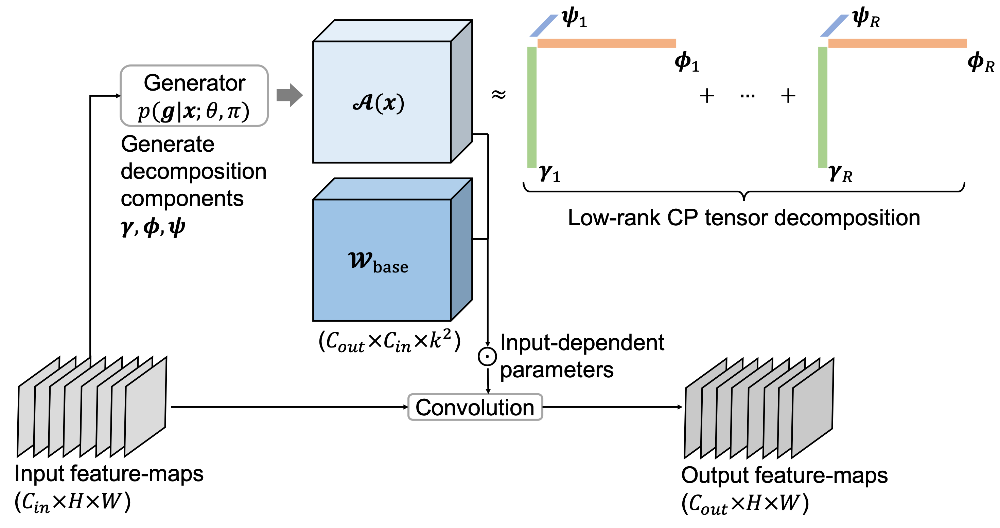

# Parameter Efficient Dynamic Convolution via Tensor Decomposition (BMVC 2021)

This repository contains the PyTorch implementation of the paper [Parameter Efficient Dynamic Convolution via Tensor Decomposition](https://www.bmvc2021-virtualconference.com/assets/papers/1631.pdf).

### Highlight
Dynamic convolution has demonstrated substantial performance improvements for convolutional neural networks. Previous aggregation based dynamic convolution methods are challenged by the parameter/memory inefficiency, and the learning difficulty due to the scalar type attention for aggregation. To rectify these limitations, we propose a
parameter efficient dynamic convolution operator (dubbed as PEDConv) that learns to discriminatively perturb the spatial, input and output filters of a shared base convolution weight, through a tensor decomposition based input-dependent reparameterization.  Our method considerably reduces the number of parameters compared to prior arts and
limit the computational cost to maintain inference efficiency. Meanwhile, the proposed PEDConv significantly boosts the accuracy when substituting standard convolutions on a plethora of prevalent deep learning tasks at almost same computation cost as the static baselines.

<div align="center">
  
</div>s

* This repo was built upon the [DeepLearningExamples](https://github.com/NVIDIA/DeepLearningExamples). Installation and setup of NVIDIA docker follows that repo.

### Prepare the dataset

* We use ImageNet-1K. [Download the images](http://image-net.org/download-images).

* Extract the training data:
```Shell
mkdir train && mv ILSVRC2012_img_train.tar train/ && cd train
tar -xvf ILSVRC2012_img_train.tar && rm -f ILSVRC2012_img_train.tar
find . -name "*.tar" | while read NAME ; do mkdir -p "${NAME%.tar}"; tar -xvf "${NAME}" -C "${NAME%.tar}"; rm -f "${NAME}"; done
cd ..
```

* Extract the validation data and move the images to subfolders:
```Shell
mkdir val && mv ILSVRC2012_img_val.tar val/ && cd val && tar -xvf ILSVRC2012_img_val.tar
wget -qO- https://raw.githubusercontent.com/soumith/imagenetloader.torch/master/valprep.sh | bash
```

### Training
Example of applying PEDConv to ResNet-18 model on ImageNet-1K using 8 GPUs:

```Shell
python ./multiproc.py --nproc_per_node 8 ./main.py /data/imagenet \
    --data-backend pytorch \
    --raport-file raport.json \
    -j8 -p 100 \
    --lr 0.512 \ 
    --optimizer-batch-size 512 
    --warmup 8 \
    --arch resnet18 \
    --dynamic \
    -c fanin \
    --label-smoothing 0.1 \
    --lr-schedule cosine \
    --mom 0.875 \
    --wd 3.0517578125e-05 \
    -b 64 \
    --epochs 250 \
    --mixup 0.2
```

### Checkpoints
We provide the trained PEDConv-ResNet-18 by the above command:

<table>
  <tr>
    <th>Model</th>
    <th>Top-1</th>
    <th>Checkpoints</th>
  </tr>
  <tr>
    <td>PEDConv-ResNet-18</td>
    <td>74.1%</td>
    <td><a href="https://drive.google.com/file/d/1943hDMg1MBZWeA4bEJAnPWRoEtAtgGXh/view?usp=sharing">download</a></td>   
  </tr>
</table>

### Evaluation

* Example of evaluating the trained PEDConv-ResNet-18 on ImageNet-1K:

```Shell
CUDA_VISIBLE_DEVICES=0 python ./main.py /data/imagenet \
    --data-backend pytorch \
    --arch resnet18 \
    --evaluate \
    --epochs 1 \
    --pretrained-weights ./logs/model_best.pth.tar \
    -b 100
```

### Citation
If you find this repository helpful, please consider citing:
```Shell
@article{hou2021parameter,
  title={Parameter Efficient Dynamic Convolution via Tensor Decomposition},
  author={Hou, Zejiang and Kung, Sun-Yuan},
  year={2021}
}
```


